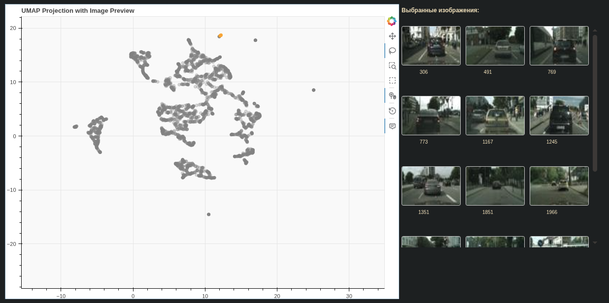
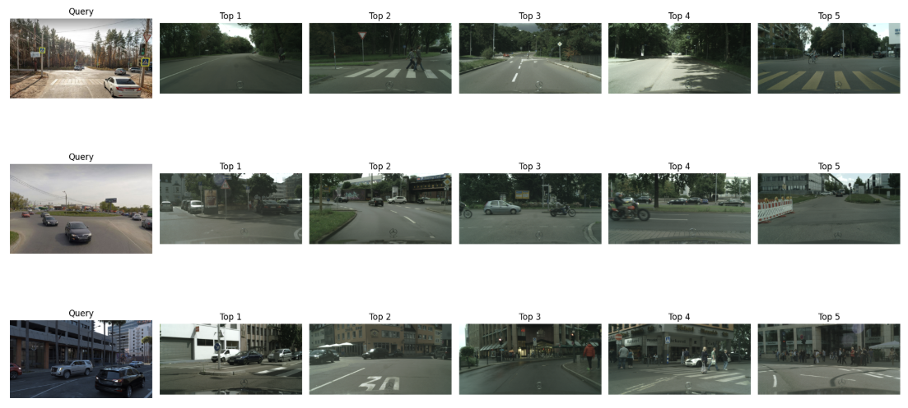

# Autonomous driving 

## 1. DINO 

**Embeddings analysis**

1. DINO
2. PCA
3. UMAP



**Retrieval demo**


## 2. Single-frame Behavioral Cloning

The behavioral cloning stage uses the [comma2k19](https://github.com/commaai/comma2k19) dataset to predict steering angle from a single camera frame. 
Frames are encoded with a frozen DINO encoder and a small MLP policy head is trained on top of the extracted embeddings.

```text
Image
↓
DINO Encoder (Frozen)
↓
MLP Policy Head
↓
Normalized steering angle
```

Implemented in `src/notebooks/3-behavioral_cloning-comma2k19.ipynb`:

- comma2k19 frame index construction with matched CAN steering angle targets.
- DINO embedding extraction.
- `CommaDataset` over precomputed embeddings and steering targets.
- MLP steering head (`CommaBCNet`) trained with `GroupKFold` split by route.
- Per-fold target normalization: train-fold `mean` and `std` are used for normalized optimization loss, then predictions are denormalized back to degrees for reporting.
- Optimizer selection with SGD or AdamW.
- ClearML experiment logging for train and validation metrics.

Logged metrics are grouped in ClearML by plot title and series to keep the Scalars UI readable:

- `train/Loss_norm` and `val/Loss_norm`: MSE loss in normalized target space, with `fold_{n}` as the series.
- `train/MSE` and `val/MSE`: steering-angle MSE in degrees, with `fold_{n}` as the series.
- `val/MAE` and `val/RMSE`: validation metrics in degrees.
- `val/{MSE,MAE,RMSE}/baselines`: baseline error metrics for `baseline_zero` and `baseline_train_mean`.
- `val/*/thresholds_mean`: threshold metrics averaged across folds for steering magnitude bins `0-3`, `3-10`, `10-30`, and `30-inf` degrees.
- `val/Count/thresholds_total`: total number of validation samples in each threshold bucket across folds.
- `val/threshold_metrics_table`: ClearML table with per-epoch, per-fold threshold metrics for detailed inspection.
- `Direction_acc`: steering direction accuracy with a 1 degree dead zone around zero.
- `Angle_ratio_mean`: clipped mean of `predicted_angle / target_angle`, computed only for targets with absolute angle at least 1 degree.

Per-fold threshold scalar logging is disabled by default to avoid plots with too many lines. Set `cfg.log_fold_threshold_scalars = True` to enable detailed per-fold threshold scalar plots (`val/*/thresholds_by_fold`). Count-like helper values for direction and ratio are kept internally for correct averaging, but are not logged as separate scalar plots by default.

